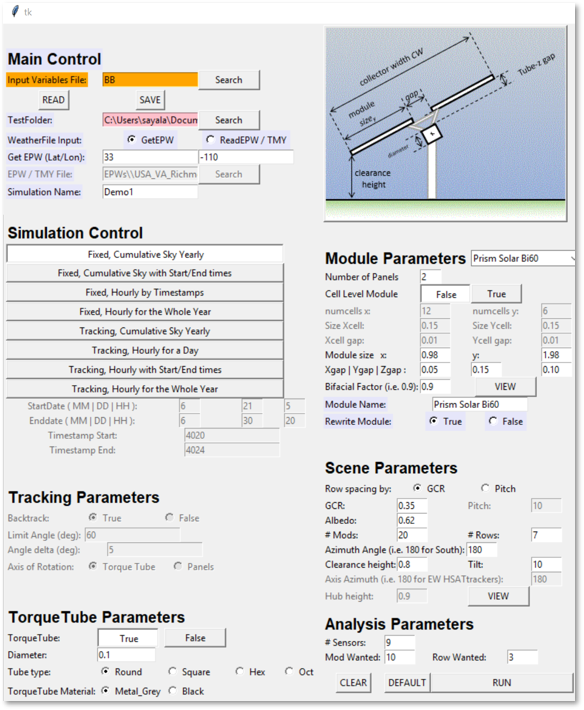

# bifacial_radiance
Main branch: 

Development branch: 

## Introduction

bifacial_radiance contains a series of Python wrapper functions to make working with 
RADIANCE easier, particularly for the PV researcher interested in bifacial PV 
performance.  For more information, check out our [documentation](https://bifacial-radiance.readthedocs.io), 
[Tutorials in the form of Jupyter Notebooks](docs/tutorials/), or reffer to our [Wiki](https://github.com/NREL/bifacial_radiance/wiki)
and [Issues](https://github.com/NREL/bifacial_radiance/issues) page.

## Installation

https://youtu.be/4A9GocfHKyM
This video shows how to install the bifacial_radiance software and all associated software needed. More info on the Wiki. Instructions are also shown below.

For detailed instructions of how to install bifacial_radiance, you can also refer to the [installation guide](https://bifacial-radiance.readthedocs.io/en/stable/installation.html)

## GUI! 

A GUI has been added in version 3.0. The GUI reads/writes all input parameters necessary to run a simulation, and runs the specified simulation by calling the correct functions with the specified parameters. So no need to use a journal or a script! But you still need to install following the procedure below. 

To run the gui, import bifacial_radiance and run bifacial_radiance.gui()

## Usage

We have a tutorial video, showing how the program is structured, how to use the Jupyter tutorials and the GUI. You can watch it here [Tutorial Webinar](https://www.youtube.com/watch?v=1X9L-R-RVGA), with the [slides available here](https://www.nrel.gov/docs/fy20osti/75218.pdf)

Check out the [Jupyter Tutorial Notebooks](docs/tutorials/) to see detailed examples of the capacities of bifacial_radiance.
The [Intro examples](https://bifacial-radiance.readthedocs.io/en/stable/introexamples.html) and the [readthedocs documentation](https://bifacial-radiance.readthedocs.io) also provide a good starting point.

## Contributing

We need your help to make bifacial_radiance a great tool! Please see the [Contributing page](https://bifacial-radiance.readthedocs.io/en/stable/contributing.html) for more on how you can contribute. The long-term success of pvlib-python requires substantial community support.

## License

Bifacial_radiance open source code is copyrighted by the Alliance for Sustainable Energy and licensed with BSD-3-Clause terms, found [here](https://github.com/NREL/bifacial_radiance/blob/master/LICENSE).

## Getting Support

If you suspect that you may have discovered a bug or if you'd like to
change something about pvlib, then please make an issue on our
[GitHub issues page](https://github.com/NREL/bifacial_radiance/issues).

bifacial_radiance questions can be asked on
[Stack Overflow](http://stackoverflow.com) and tagged with
the [bifacial_radiance](http://stackoverflow.com/questions/tagged/bifacial_radiance) tag.

The [bifacial-radiance google group](https://groups.google.com/forum/#!forum/bifacial_radiance) 
has just started, and will be used for discussing various topics of interest to the bifacial-radiance
community. We also make new version announcements on the google group.

## Citing

If you use bifacial_radiance in a published work, please cite:

    Ayala Pelaez and Deline, (2020). bifacial_radiance: a python package for modeling bifacial solar photovoltaic systems. Journal of Open Source Software, 5(50), 1865, https://doi.org/10.21105/joss.01865

Please also cite the DOI corresponding to the specific version of bifacial_radiance that you used. bifacial_radiance DOIs are listed at [Zenodo.org](https://zenodo.org/search?page=1&size=20&q=conceptrecid:3860349&all_versions&sort=-version)

Additional bifacial_radiance publications with validation of the software include:
* Deline, Chris, and Ayala, Silvana. Bifacial_Radiance. Computer Software. https://github.com/NREL/bifacial_radiance. USDOE Office of     Energy Efficiency and Renewable Energy (EERE), Solar Energy Technologies Office (EE-4S). 17 Dec. 2017. Web. doi:10.11578/dc.20180530.16. https://www.osti.gov/doecode/biblio/6869
* Ayala Pelaez S, Deline C, Greenberg P, Stein JS, Kostuk RK. Model and validation of single-axis tracking with bifacial PV. IEEE J Photovoltaics. 2019;9(3):715-721. https://ieeexplore.ieee.org/document/8644027 and https://www.nrel.gov/docs/fy19osti/72039.pdf (pre-print, conference version)
* Ayala Pelaez, Deline C, MacAlpine M, Marion B, Stein J, Kostuk K. Comparison of Bifacial Solar Irradiance Model Predictions with Field Validation. IEEE J Photovoltaics. 2019; 9(1):82-87. https://ieeexplore.ieee.org/document/8534404

Or check our [Github Wiki](https://github.com/NREL/bifacial_radiance/wiki) for a complete list of publications.
