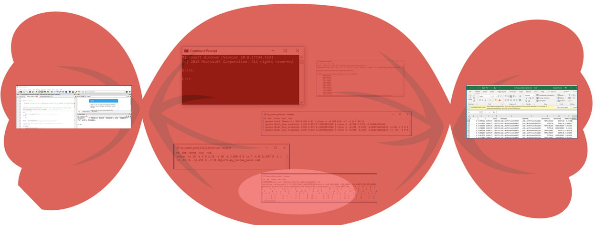
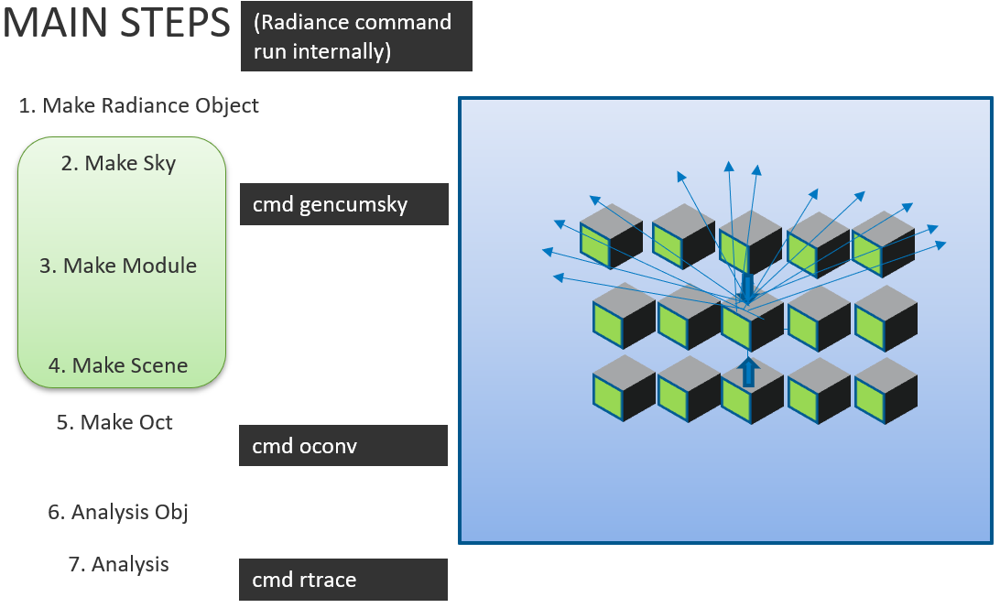

.. _package_overview:

Package Overview
================

The following section describes some of the functionalities of bifacial_radiance, and how the software is structured. For a SUPER complete explanation and package overview, we highly recommend you watch our `Webinar tutorial video <https://www.youtube.com/watch?v=1X9L-R-RVGA>`_. (`Slides here <https://www.nrel.gov/docs/fy20osti/75218.pdf>`_.

bifacial_radiance is a python wrapper for calling and using Radiance, with specific functions to generate geometry (text files) related to bifacial photovoltaic systems

A full example might look like:

.. code-block :: python

        from bifacial_radiance import *
        demo = RadianceObj()
        demo.setGround()
        epwfile = demo.getEPW(37.5, -77.6)
        metdata = demo.readWeatherFile(epwfile)
        demo.gendaylit(2000)
        myModule = demo.makeModule ("My_panel", x=1,y=2)
        sceneDict = {'tilt':30, 'pitch':3, 'clearance_height':0.5, 'azimuth':180, 'nMods':10, 'nRows':4}
        scene = demo.makeScene(myModule, sceneDict)
        octfile = demo.makeOct()
        analysis = AnalysisObj(octfile, demo.name)
        frontscan, backscan = analysis.moduleAnalysis(scene)
        analysis.analysis(octfile, demo.name, frontscan, backscan)

What this example is showing are the main/minimum instructions or steps needed to run a simulation, which are:

1. Make a Radiance Object
2. Make Sky - generates a hourly or cumulative sky based on the given weather file irradiance data. Saves files in skies folder and in main folder.
3. Make Module - creates a module of your desire. Cell-level module, and 1-up or more configurations. Saves the module info as a .rad in objects folder.
4. Make Scene - replicates your module at the desired pitch/tilt for desired number of rows / modules per row. Saves the scene info as a .rad in objects folder.
5. Make Oct - creates a .oct file that ties Sky, Module, and Scene.
6. Analysis Obj - calculates the coordinates that will be sampled for irradiance. You can specify any module and row desired or custom coordinates.
7. Analysis - runs the Radiance rtrace command and saves the measured irradiance values for the surface specified in the results folder.

Each of this steps has more options than described here, so we really recommend looking at the  `Webinar tutorial <https://www.youtube.com/watch?v=1X9L-R-RVGA>`_ And our `Jupyter Notebook tutorials <http://github.com/NREL/bifacial_radiance/tree/master/docs/tutorials/>`_, as well as the :ref:`manualapi` as each function has description of input parameters.
