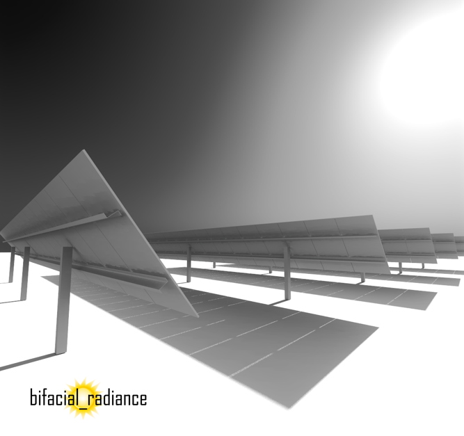

# Summary

bifacial_radiance is a national-laboratory-developed, community-supported, open-source toolkit that provides a set of functions and classes for simulating the performance of bifacial photovoltaic (PV) systems. (Bifacial PV modules collect light on the front as well as the rear side.) bifacial_radiance automates calculations of PV system layout and performance to use along with the popular ray-tracing software tool RADIANCE [@Ward1994]. Specific algorithms include design and layout of PV modules, reflective ground surfaces, shading obstructions, and irradiance calculations throughout the system, among others. bifacial_radiance is an important component of a growing ecosystem of open-source tools for solar energy [@Holmgren2018].

{ width=80% }

bifacial_radiance is hosted on Github and PyPi, and it was developed by contributors from national laboratories, academia, and private industry. bifacial_radiance is copyrighted by the Alliance for Sustainable Energy with a BSD 3-clause license allowing permissive use with attribution. bifacial_radiance is extensively tested for functional and algorithm consistency. Continuous integration services check each pull request on Linux and Python versions 2.7 and 3.6. The bifacial_radiance application programming interface (API) is thoroughly documented, and detailed tutorials are provided for many features. The documentation includes help for installation and guidelines for contributions. The documentation is hosted at readthedocs.org as of this writing. Github’s issue trackers, a Google group and StackOverflow tag provide venues for user discussions and help.

The bifacial_radiance API and graphical user interface (GUI) were designed to serve the various needs of the many subfields of bifacial solar panel power research and engineering. The intended audience ranges from PV performance researchers, Engineering Procurement Construction (EPC) companies, installers, investors, consumers and analysts of the PV industry interested in predicting and evaluating bifacial photovoltaic systems. It is implemented in three layers: core RADIANCE-interface functions; ``Bifacial-Radiance``, ``Meteorological``, ``Scene``, and ``Analysis`` classes; and the ``GUI`` and ``model-chain`` classes. The core API consists of a collection of functions that implement commands directly to the RADIANCE software. These commands are typical implementations of algorithms and models described in peer-reviewed publications. The functions provide maximum user flexibility; however, some of the function arguments require an unwieldy number of parameters. The next API level contains the ``Bifacial-Radiance``, ``Meteorological``, ``Scene``, and ``Analysis`` classes. These abstractions provide simple methods that wrap the core function API layer and communicate with the RADIANCE software, which provides ray-trace processing capabilities. The method API simplification is achieved by separating the data that represent the object (object attributes) from the data that the object methods operate on (method arguments). For example, a ``Bifacial-Radiance`` object is represented by a ``module`` object, meteorological data, and ``scene`` objects. The ``gendaylit`` method operates on the meteorological data to calculate solar position with the support of algorithms from pvlib python [@pvlib], and generate corresponding sky files, linking them to the ``Bifacial-Radiance`` object. Then the ``makeOct`` method combines the sky files, ``module`` and ``scene`` objects when calling the function layer, returning the results from an ``Analysis`` object to the user. The final level of API is the ``ModelChain`` class, designed to simplify and standardize the process of stitching together the many modeling steps necessary to convert a time series of weather data to AC solar power generation, given a PV system and a location. The ``ModelChain`` also powers the ``GUI``, which provides a cohesive visualization of all the input parameters and options for most common modeling needs.

bifacial_radiance was first coded in Python and released as a stable version in Github in 2017 [@MacAlpine2017], and it was submitted as a U.S. Department of Energy Code project on December of the same year [@Deline2017]. Efforts to make the project more pythonic were undertaken in 2018 [@Ayala2018]. Additional features continue to be added as described in @Ayala2019, @Stein2019, and in the documentation’s “What’s New” section.

bifacial_radiance has been used in numerous studies, for example, for modeling and validation of rear irradiance for fixed-tilt systems [@Ayala2019b], estimation of energy gain and performance ratio for single-axis-tracked bifacial systems [@Berrian2019; @Ayala2019c], as well as the study of edge effects [@Ayala2019c] and smart tracking algorithms [@Ayala2018b]; estimation of shading factor from racking structures [@Ayala2019d], and parameterization of electrical mismatch power losses due to irradiance nonuniformity in bifacial systems [@Deline2019; @Deline2019b; @Ayala2019e]. Sensitivity studies of installation and simulation parameters [@Asgharzadeh2018] and optimization for bifacial fields with the aid of high-performance computing [@Stein2019; @Stein2019b] have also been performed with bifacial_radiance. Furthermore, benchmarking with other rear-irradiance calculation software has been performed on several occasions [@Ayala2018b; @DiOrio2018; @Capelle2019]. Rear-irradiance calculation software fall into two categories: view-factor and ray-tracing models. View factor models assume isotropic scattering of reflected rays, allowing for calculation of irradiance by integration [@Marion2017]. Due-diligence software such as PVSyst or SAM use the view-factor model [@PVSyst; @SAM]. There are also some open-source view-factor models, such as bifacialvf, and PVFactors [@bifacialvf; @PVfactors]. Ray-tracing models simulate multipath reflection and absorption of individual rays entering a scene. Raytracing software such as bifacial_radiance, which is the only available open-source toolkit, offers the possibility of reproducing complex scenes, including shading or finite-system edge effects. Model agreement for view factor and bifacial_radiance software is better than 2\% (absolute) when compared with measured results. [@Ayala2018b]. 

Plans for bifacial_radiance development include the implementation of new and existing models, addition of functionality to assist with input/output, and improvements to API consistency.

# Acknowledgements

The authors acknowledge and thank the code, documentation, and discussion contributors to the project.

S.A.P. and C.D. acknowledge support from the U.S. Department of Energy’s Solar Energy Technologies Office. This work was authored, in part, by the National Renewable Energy Laboratory, operated by Alliance for Sustainable Energy, LLC, for the U.S. Department of Energy (DOE) under Contract No. DE-AC36-08GO28308. Funding was provided by the U.S. Department of Energy’s Office of Energy Efficiency and Renewable Energy (EERE) under Solar Energy Technologies Office Agreement Number 34910.

The National Renewable Energy Laboratory is a national laboratory of the U.S. Department of Energy, Office of Energy Efficiency and Renewable Energy, operated by the Alliance for Sustainable Energy, LLC.

# References